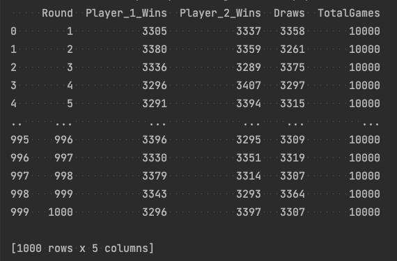
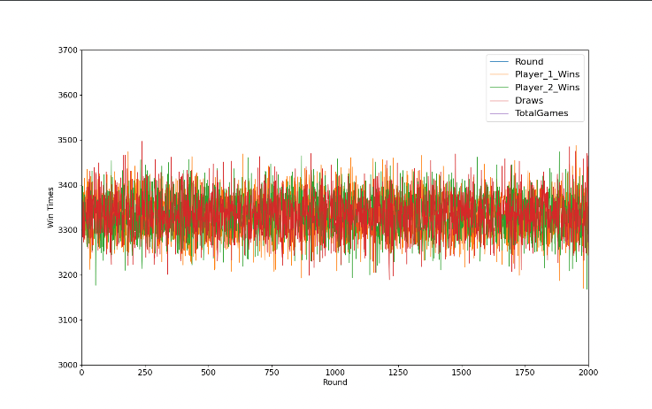

## Rock Paper Scissors

Was originally trying to make a simple Rock Paper Scissors game, got bored. Eventually I decided to plot the results of
two bots playing and see if the possibilities of winning the game is really 50/50.

It sort of is.

### Setup

---
```
git clone https://github.com/wpted/automated-rock-paper-scissors.git
cd automated-rock-paper-scissors.git
pip install -r requirements.txt
python main.py
```


### ScreenShots

---


